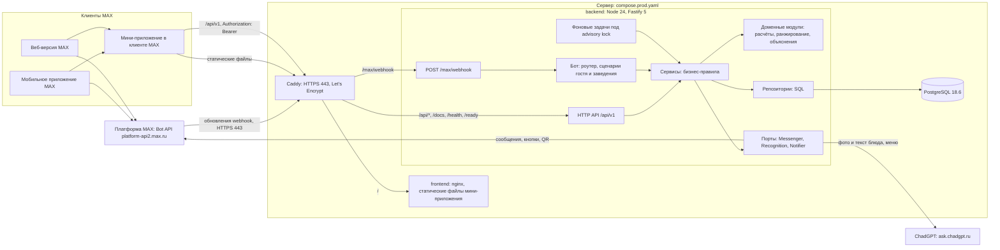
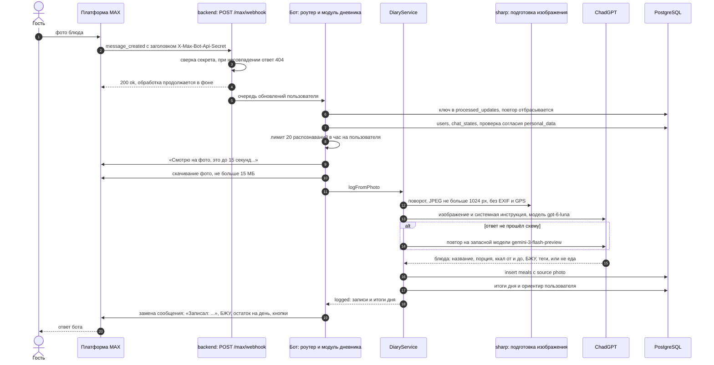
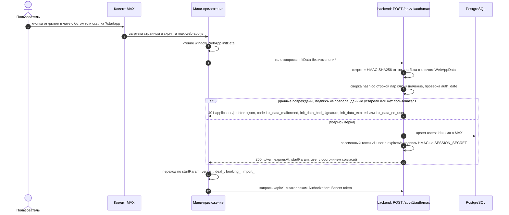
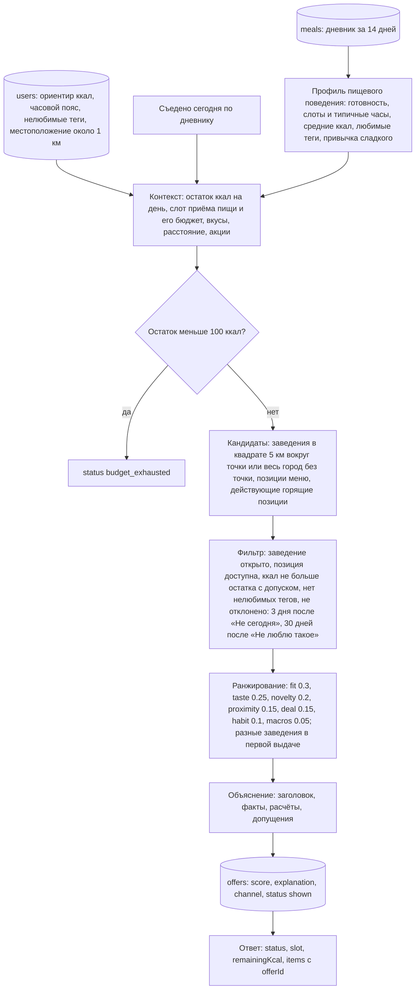
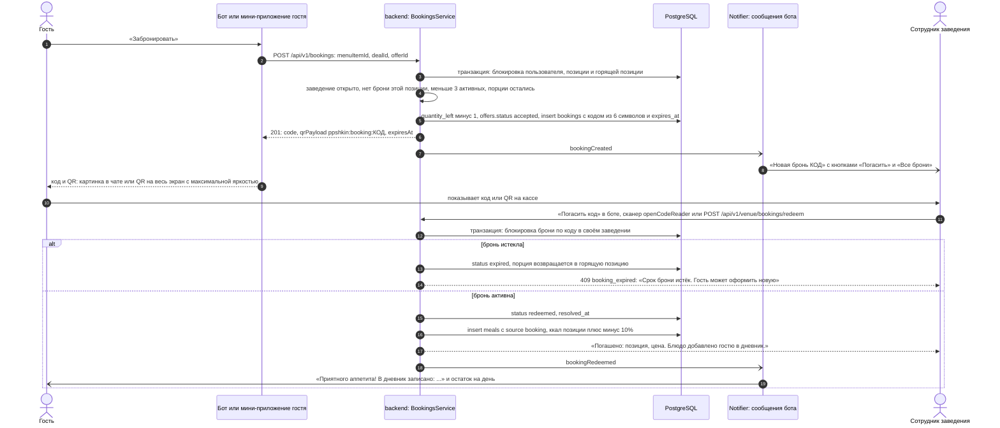
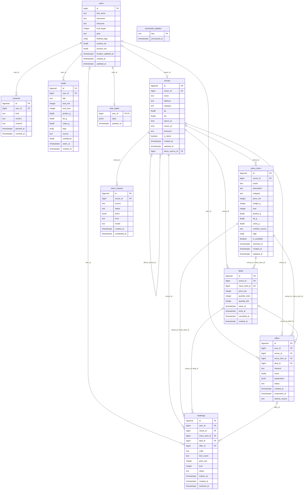

# Архитектура ППшкин

Документ описывает устройство решения: компоненты и их связи, основные последовательности запросов, конвейер рекомендаций, схему базы данных, формат ошибок, аутентификацию, ограничения частоты запросов, фоновые задачи, режимы бота и меры безопасности. Как запустить и проверить решение, описано в [README.md](../README.md), пошаговые сценарии в [scenario.md](scenario.md), развёртывание в [deploy.md](deploy.md).

## 1. Компоненты

ППшкин состоит из трёх сервисов Docker и двух внешних систем. `backend` на Node 24 и Fastify 5 объединяет в одном процессе HTTP API, бота MAX и планировщик фоновых задач. `frontend` раздаёт статические файлы мини-приложения через nginx. PostgreSQL 18.6 хранит все данные. В продакшене ([compose.prod.yaml](../compose.prod.yaml)) перед ними стоит Caddy, который принимает HTTPS на 443 и выпускает сертификат Let's Encrypt, наружу опубликован только он.



Локально ([compose.yaml](../compose.yaml)) Caddy нет: backend публикуется на `localhost:3000`, мини-приложение на `localhost:8080` (nginx проксирует `/api/` на backend), база только на `127.0.0.1:55432`, бот по умолчанию выключен (`BOT_MODE=off`).

### Внешние сервисы

| Сервис | Назначение | Адрес и условия | Что передаётся |
|---|---|---|---|
| MAX Bot API | сообщения бота, кнопки, загрузка изображений, webhook | `https://platform-api2.max.ru` (обязателен с 19.07.2026), сертификат цепочки Минцифры (`backend/certs/russian_trusted_root_ca.pem`, `NODE_EXTRA_CA_CERTS`), токен в заголовке `Authorization`; лимиты 30 запросов в секунду и 2 сообщения в секунду на чат; webhook только HTTPS на порт 443 с доверенным сертификатом, ответ 200 за 30 секунд | тексты ответов бота, клавиатуры, QR-код брони; от MAX приходят сообщения, фото и геопозиция пользователя |
| MAX Bridge | данные запуска мини-приложения и функции устройства | скрипт `https://st.max.ru/js/max-web-app.js`; подпись `initData` проверяется на бэкенде (HMAC-SHA256 с ключом `WebAppData` и токеном бота) | ничего не отправляется во внешние сервисы, кроме вызовов функций клиента MAX |
| MAX UI | компоненты интерфейса мини-приложения | `@maxhub/max-ui` 0.5.0, лицензия MIT | нет |
| ChadGPT | распознавание блюд по фото и тексту, разбор меню | `https://ask.chadgpt.ru/api/v1`, OpenAI-совместимый API, ключ `CHADGPT_API_KEY`, модели `gpt-6-luna` и запасная `gemini-3-flash-preview`; фото блюда 4-10 с, меню 11-23 с | фото после перекодирования в JPEG не больше 1024 px по длинной стороне без метаданных (EXIF, GPS), текст описания блюда или меню, системная инструкция. Не передаются идентификаторы MAX, имя, телефон, местоположение. Место обработки данных провайдером не подтверждено, поэтому сервис считается возможно трансграничным |
| Let's Encrypt | сертификат HTTPS в продакшене | через Caddy (#19) | доменное имя |
| GitHub Container Registry | образы backend и frontend | `ghcr.io/blsssss/ppshkin-backend`, `ghcr.io/blsssss/ppshkin-frontend` (#19) | нет |

## 2. Слои backend

Запрос идёт сверху вниз и никогда не перескакивает слой:

| Слой | Каталог | Правило |
|---|---|---|
| Маршруты | `backend/src/http/routes/` | тонкие плагины Fastify: разбор запроса по zod-схеме, вызов сервиса, преобразование модели в DTO (`backend/src/http/schemas/`). SQL и бизнес-правил нет |
| Бот | `backend/src/bot/` | роутер обновлений MAX и модули сценариев гостя (`guest/`) и заведения (`venue/`); вызывает те же сервисы, что и HTTP API |
| Сервисы | `backend/src/services/` | бизнес-правила и транзакции (`withTransaction`); фабрики `createXxxService(deps)` получают пул, часы, порты и настройки явно, глобальных объектов нет |
| Репозитории | `backend/src/repositories/` | только параметризованный SQL, колонки перечисляются явно, строки превращаются в доменные модели |
| Доменные модули | `backend/src/domain/` | чистые функции без ввода-вывода: ориентир калорий и слоты приёма пищи (`nutrition/`), профиль пищевого поведения, ранжирование и объяснения (`intent/`), правила броней и согласий |
| Порты | `backend/src/ports/` | интерфейсы внешних систем: `Messenger` (отправка, редактирование, загрузка изображений, скачивание файлов в MAX), `Recognition` (распознавание блюд и меню), `Notifier` (уведомления о бронях) |
| Реализации портов | `backend/src/integrations/`, `backend/src/recognition/`, `backend/src/notifications/` | клиент MAX Bot API, клиент ChadGPT с подготовкой изображений, уведомления через бота |

Сервисы зависят от портов, а не от реализаций. Поэтому без бота (нет `MAX_BOT_TOKEN` или `BOT_MODE=off`) вместо уведомлений работает `silentNotifier`, без `CHADGPT_API_KEY` распознавание переключается на офлайн-реализацию (справочник типичных порций для текста и эвристика для текстового меню), а тесты подставляют заглушки. Сборка зависимостей находится в `backend/src/container.ts`, точка входа в `backend/src/main.ts`.

## 3. Запись приёма пищи по фото

Бот принимает обновления MAX через webhook, сразу отвечает 200 и обрабатывает обновление в фоне. Обновления одного пользователя обрабатываются строго по очереди, повторная доставка того же обновления отбрасывается по ключу в `processed_updates`.



Другие исходы того же шага: «Похоже, на фото не еда...» с кнопкой «Ввести вручную», несколько вариантов блюда на выбор при низкой уверенности, «Распознавание фото сейчас выключено...» без ключа ChadGPT и «Сервис распознавания не ответил...» при сбое. Текстовое описание («съел борщ») проходит тот же путь без скачивания и подготовки изображения, а без ChadGPT оценивается по справочнику типичных порций. Запись вида «Сырники 350» сохраняется сразу, без распознавания.

## 4. Вход в мини-приложение

Мини-приложение не хранит паролей: вход выполняется по подписанным данным запуска `initData`, которые клиент MAX передаёт через MAX Bridge.



Если `personalData.granted` в ответе равно `false`, мини-приложение сначала показывает экраны согласий. Токен живёт `SESSION_TTL_HOURS` (по умолчанию 12 часов); на ответ 401 с кодом `invalid_token` мини-приложение входит заново по `initData`. Открытое вне MAX, оно показывает экран «Откройте ППшкин в MAX» со ссылкой на бота.

## 5. Конвейер рекомендаций

Подбор отвечает на вопрос «что съесть сейчас рядом, чтобы вписаться в день». Конвейер одинаков для бота («Что поесть?»), мини-приложения и `GET /api/v1/recommendations`; каждый показ сохраняется в `offers` вместе с объяснением.



Пояснения к факторам (`backend/src/domain/intent/rank.ts`):

- `fit`: насколько калорийность блюда близка к бюджету текущего слота (завтрак 25%, обед 35%, перекус 10%, ужин 30% от ориентира, но не больше остатка);
- `taste`: совпадение тегов блюда с любимыми тегами из профиля;
- `novelty`: штраф за блюдо, которое сегодня уже показывали;
- `proximity`: чем ближе заведение, тем выше;
- `deal`: размер скидки горящей позиции и срочность, если до конца акции меньше 2 часов;
- `habit`: десерт около привычного часа сладкого или категория, типичная для слота;
- `macros`: блюдо с высоким белком, если день получился бедным на белок.

Пока в дневнике за 14 дней нет записей, подбор отвечает статусом `profile_empty` без блюд, а бот предлагает записать еду или, в демо-режиме, «Заполнить дневник примером». Профиль готов, когда есть не меньше 5 приёмов пищи и 2 дней с записями; до этого подбор уже работает, а бот подсказывает, сколько записей осталось. Без местоположения расстояние не учитывается (`proximity` 0.5), а в демо-режиме для точки дальше 50 км от центра Казани расстояние считается от точки `55.7887, 49.1221` на ул. Баумана (`demoCenterUsed: true`), чтобы тестовые заведения можно было проверить из любого города. Объяснение отделяет факты («Сегодня в дневнике ещё нет записей»), расчёты («До ориентира 1800 ккал остаётся около 1800 ккал», «Идти около 350 м») и допущения («Калорийность приблизительная, это не медицинская рекомендация», «Заведение и меню тестовые»). Ранжирование не платное, заведения не могут купить место в выдаче.

## 6. Бронь и погашение

Бронь удерживает порцию до погашения, отмены или истечения. Срок брони: 60 минут, но не позже конца горящей позиции и закрытия заведения. У гостя не больше 3 активных броней и не больше одной активной брони на позицию.



Код брони состоит из 6 символов алфавита без похожих знаков (`ABCDEFGHJKLMNPQRSTUVWXYZ23456789`), QR содержит строку `ppshkin:booking:<код>`. При вводе кода кириллические буквы, похожие на латинские, и пробелы нормализуются. Задача `expire_bookings` раз в минуту переводит просроченные брони в `expired`, возвращает порции в горящие позиции и присылает гостю «Бронь <код> истекла...». Отмена гостем возвращает порцию и уведомляет заведение.

## 7. Модель данных

Схема задаётся миграциями [0001_init.sql](../backend/migrations/0001_init.sql), [0002_offer_feedback.sql](../backend/migrations/0002_offer_feedback.sql) и [0003_demo_copies.sql](../backend/migrations/0003_demo_copies.sql). Служебную таблицу `schema_migrations` (версия, контрольная сумма, время применения) создаёт при первом запуске `backend/src/db/migrate.ts`.



Ключевые ограничения:

- `consents`: одно действующее согласие каждого вида на пользователя (уникальный индекс по `user_id, kind` для строк без `revoked_at`); `kind` это `personal_data` или `personalized_offers`, `channel` это `bot` или `miniapp`.
- `venues`: одно заведение на владельца (уникальный индекс по `owner_id`); `demo_source_id` заполняется только у копий демо-заведений (`is_demo`).
- `deals`, `offers`, `bookings` ссылаются на позицию составным ключом `(venue_id, menu_item_id)`, поэтому позиция другого заведения не может попасть в акцию или бронь.
- `bookings`: код из алфавита `[A-HJ-NP-Z2-9]{6}` уникален среди активных броней заведения; у гостя одна активная бронь на горящую позицию; `resolved_at` заполнен тогда и только тогда, когда бронь не активна.
- При удалении пользователя `consents`, `meals` и `chat_states` удаляются каскадно, а в `offers` и `bookings` `user_id` становится `NULL` (обезличивание для агрегатов заведения).
- `float8` в схеме это `double precision`, `text[]` это массив строк.

## 8. Формат ошибок

Все ошибки API отдаются в формате RFC 9457 с типом содержимого `application/problem+json` (`backend/src/http/problem.ts`):

```json
{"type":"about:blank","title":"Unauthorized","status":401,"code":"unauthorized","detail":"Authentication required"}
```

- `code` в snake_case это контракт с клиентом: по нему мини-приложение выбирает текст и действие. Коды каждого метода перечислены в его описании в [openapi.yaml](../openapi.yaml).
- `detail` пишется по-английски и не содержит SQL, стеков и ответов внешних сервисов.
- Невалидный ввод получает 400 `validation_failed` с массивом `errors` из пар `path` и `message`; неизвестный маршрут 404 `route_not_found`; непредвиденная ошибка 500 `internal_error` без подробностей.
- Метод, требующий входа, проверяет токен раньше тела запроса, поэтому запрос без токена получает 401, а не 400.
- Статусы, которые использует API: 400, 401, 403, 404, 409, 413, 415, 422, 429, 500, 503.

## 9. Аутентификация

| Способ | Где | Как проверяется |
|---|---|---|
| Подпись `initData` | `POST /api/v1/auth/max` | HMAC-SHA256: секрет это HMAC от токена бота с ключом `WebAppData`, сравнение за постоянное время, возраст `auth_date` не больше `INIT_DATA_MAX_AGE_SECONDS` (по умолчанию 3600 секунд) |
| Сессионный токен | заголовок `Authorization: Bearer` на `/api/v1` | токен `v1.<userId>.<expiresAt>.<подпись>`, подпись HMAC-SHA256 на `SESSION_SECRET` (без него ключ выводится из `MAX_BOT_TOKEN`), срок `SESSION_TTL_HOURS` |
| Демо-токены | заголовок `Authorization: Bearer` | только при `DEMO_MODE=true`: сравнение за постоянное время с `DEMO_GUEST_TOKEN` (`userId -1001`) и `DEMO_VENUE_TOKEN` (`userId -1002`). Демо-учётки нельзя удалить, и они не могут взять копию демо-заведения |
| Бот | обновления MAX | пользователь определяется платформой MAX, webhook принимается только с верным `X-Max-Bot-Api-Secret` |

Конфигурация отклоняет демо-токены без `DEMO_MODE=true`, демо-режим без токенов и локальные токены с префиксом `local-demo-` при `BOT_MODE=webhook`. Роль заведения не отдельная учётка: любой пользователь становится владельцем, когда создаёт заведение или берёт копию демо-заведения, и методы `/api/v1/venue/*` работают только с его заведением.

## 10. Ограничения частоты запросов

| Что | Лимит | Ключ |
|---|---|---|
| Весь API | `RATE_LIMIT_PER_MINUTE` в минуту, по умолчанию 300 | пользователь; демо-роль и IP для демо-токенов; IP без входа |
| `POST /api/v1/auth/max` | 30 в минуту | IP |
| Распознавание блюда по фото и тексту | 20 в минуту | пользователь |
| Рекомендации, QR брони | 30 в минуту | пользователь |
| Импорт меню по фото | 10 в минуту | пользователь |
| Импорт меню текстом | 20 в минуту | пользователь |
| Распознавание в боте | 20 в час | пользователь |
| Импорт меню в боте и через API | 20 импортов в день, один одновременно | заведение |
| Запросы к MAX Bot API | 25 в секунду всего, 2 в секунду на чат | процесс backend |

`/health` и webhook MAX не ограничиваются. Превышение даёт 429 `application/problem+json` с заголовком `Retry-After`; ответы несут `X-RateLimit-Limit`, `X-RateLimit-Remaining` и `X-RateLimit-Reset`. Клиент MAX повторяет запросы при 429 и 5xx до 3 попыток.

## 11. Фоновые задачи

Планировщик (`backend/src/jobs/scheduler.ts`) проверяет расписание каждые 15 секунд. Каждая задача выполняется под advisory lock PostgreSQL (`pg_try_advisory_lock` по имени задачи на отдельном пуле соединений), поэтому при нескольких экземплярах backend задача в каждый момент идёт только в одном из них, а занятая блокировка просто пропускает запуск.

| Задача | Расписание | Что делает |
|---|---|---|
| `expire_bookings` | каждую минуту | просроченные брони в `expired`, порции обратно в горящие позиции, уведомление гостю |
| `fail_stale_imports` | каждые 5 минут | зависшие импорты меню в `failed` |
| `purge_processed_updates` | каждый час | удаление ключей обновлений MAX старше 2 дней |
| `max_webhook_guard` | каждые 10 минут, только `BOT_MODE=webhook` | проверка подписки webhook и восстановление, если её нет или в ней не хватает типов обновлений |
| `refresh_demo_data` | ежедневно в 06:00 по Москве, только `DEMO_MODE=true` | горящие позиции на сегодня, дневник демо-гостя, история аналитики |
| `proactive_offers` | каждые 15 минут, только `PROACTIVE_OFFERS=true` | подсказки гостям с согласием на персональные предложения; в MVP выключена |

Миграции при старте тоже выполняются под advisory lock, поэтому одновременный запуск двух экземпляров не применяет миграцию дважды.

## 12. Режимы бота

| `BOT_MODE` | Где | Как работает |
|---|---|---|
| `webhook` | продакшен (`compose.prod.yaml`) | при старте backend подписывается на `https://<домен>/max/webhook` с секретом `MAX_WEBHOOK_SECRET` и удаляет подписки на другие адреса; требует `MAX_BOT_TOKEN`, `MAX_WEBHOOK_SECRET`, `PUBLIC_BASE_URL` (HTTPS без порта) и `SESSION_SECRET` |
| `polling` | разработка с отдельным ботом | long polling метода `updates` MAX Bot API с ожиданием до 30 секунд; при старте удаляет все подписки webhook этого бота |
| `off` | локальный `compose.yaml`, CI | бот не запускается, API и фоновые задачи работают |

Не запускайте `polling` с токеном рабочего бота: подписка webhook рабочего бота пропадёт, и он будет молчать, пока `max_webhook_guard` её не восстановит (до 10 минут). Команды бота (`/start`, `/eat`, `/today`, `/bookings`, `/profile`, `/venue`, `/help`, `/delete`) регистрируются в MAX при каждом старте.

## 13. Меры безопасности

- Секреты (`MAX_BOT_TOKEN`, `CHADGPT_API_KEY`, `SESSION_SECRET`, `MAX_WEBHOOK_SECRET`, демо-токены, `POSTGRES_PASSWORD`) хранятся только в `.env` на сервере с правами `600` и в секретах GitHub Actions. В репозитории только [.env.example](../.env.example) с пустыми секретами и локальными демо-значениями.
- HTTPS везде снаружи: Caddy выпускает сертификат Let's Encrypt, HTTP перенаправляется на HTTPS, заголовок `Strict-Transport-Security`. Наружу опубликованы только порты Caddy, backend и база объявлены через `expose`; локально база слушает только `127.0.0.1`.
- Webhook принимается только с заголовком `X-Max-Bot-Api-Secret`, совпадающим с `MAX_WEBHOOK_SECRET` (сравнение хешей за постоянное время); иначе ответ 404, как у несуществующего маршрута.
- В журналах backend маскируются `Authorization` и `X-Max-Bot-Api-Secret`, Caddy удаляет секрет webhook из своих записей, журнал запросов Caddy выключен, чтобы координаты из query-параметров не попадали в его логи. Сам backend записывает о запросе только метод и путь без параметров и без IP-адреса клиента (сериализатор `req` в `backend/src/http/app.ts`), журналы контейнеров в продакшене ротируются: не больше пяти файлов по 10 МБ на сервис ([privacy.md](privacy.md)).
- Все SQL-запросы параметризованы; входные данные проверяются строгими zod-схемами с границами чисел, длин и перечислений.
- Загрузка фото: не больше 10 МБ через API и 15 МБ из чата MAX, тип определяется по содержимому (JPEG, PNG, WebP), перед отправкой в ChadGPT изображение перекодируется в JPEG без метаданных. Тело обычного запроса не больше 1 МБ.
- Заголовки безопасности `@fastify/helmet`, CORS выключен по умолчанию, контейнеры запускаются от непривилегированного пользователя (`node` в backend, `nginx-unprivileged` в frontend).
- Местоположение округляется до сотых градуса (около 1 км) до записи в базу.
- Удаление аккаунта (`/delete`, `DELETE /api/v1/me`) в одной транзакции отменяет активные брони, очищает объяснения показанных предложений, удаляет копии демо-заведений и пользователя; показы и брони остаются в статистике заведения обезличенными.
- Демо-режим включается только явно, локальные демо-токены отклоняются в режиме `webhook`.

Подробности обработки персональных данных: [privacy.md](privacy.md).
