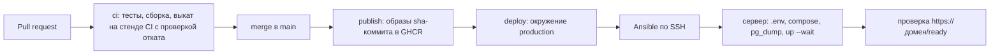

# Развёртывание на сервере

ППшкин работает на одном сервере: Caddy принимает HTTPS на 443 и сам выпускает сертификат Let's Encrypt, backend и мини-приложение запускаются из готовых образов GHCR, PostgreSQL хранит данные на томе Docker. Состав сервисов описан в [compose.prod.yaml](../compose.prod.yaml) и [deploy/Caddyfile](../deploy/Caddyfile), настройку сервера и выкат выполняет Ansible из [deploy/ansible](../deploy/ansible), запускает выкат GitHub Actions.

Рабочий домен сервиса `hackathon.easymythic.dev`, ниже `<домен>` означает его. Наружу опубликован только Caddy (порты 80, 443/tcp и 443/udp). Backend и база доступны только внутри сети проекта Docker.

Маршрутизация Caddy:

| Путь | Куда |
|---|---|
| `/api/*`, `/docs`, `/docs/*`, `/health`, `/ready`, `/max/webhook` | `backend:3000` |
| всё остальное | `frontend:8080` (статические файлы мини-приложения) |

Журнал запросов Caddy выключен намеренно: в query-параметрах есть координаты пользователей. Backend по той же причине пишет в журнал только метод и путь запроса, без параметров и IP-адреса клиента. Журналы всех контейнеров ротируются: не больше пяти файлов по 10 МБ на сервис (`x-logging` в `compose.prod.yaml`). Из остальных записей Caddy (например, об ошибке 502, пока backend перезапускается) удаляется заголовок `X-Max-Bot-Api-Secret` с секретом webhook. Заголовок `X-Frame-Options` не ставится, потому что веб-версия MAX открывает мини-приложение в iframe с другого домена. Лимит тела запроса 11 МБ чуть больше лимита загрузки фото (10 МБ).

## Непрерывная поставка

Состояние продакшена целиком описано в репозитории: состав сервисов, конфигурация Caddy, настройка сервера и версии образов. Любое изменение попадает на сервер только через pull request в `main`, вручную на сервере ничего не правится.



Как устроен выкат:

- Каждый push в `main` собирает образы `ghcr.io/blsssss/ppshkin-backend` и `ghcr.io/blsssss/ppshkin-frontend` с неизменяемым тегом `sha-<7 символов коммита>` ([publish.yml](../.github/workflows/publish.yml)) и сразу вызывает [deploy.yml](../.github/workflows/deploy.yml) для этого коммита.
- Job `deploy` работает в окружении GitHub `production`: выкатывать в него можно только из ветки `main`, секреты окружения доступны только этому job. Выкаты идут по одному (`concurrency`), история видна на вкладке Deployments репозитория.
- Ansible берёт `compose.prod.yaml`, `deploy/Caddyfile` и роли из того же коммита, что и образы, поэтому код и конфигурация на сервере всегда из одной версии.
- Плейбук идемпотентный: каждый выкат заново применяет всё состояние, включая файл `.env`, и перезаписывает ручные изменения на сервере.
- Перед выкатом делается копия базы, после `up --wait` Docker ждёт, пока все сервисы станут здоровыми. Если новая версия не поднялась, Ansible возвращает предыдущий тег и завершает job ошибкой.
- Job `deploy` в [ci.yml](../.github/workflows/ci.yml) на каждом pull request выполняет тот же плейбук на раннере CI: выкатывает рабочую версию, проверяет HTTPS, демо-данные, права на `.env` и копию базы, затем выкатывает версию с падающим backend и проверяет, что вернулась рабочая.

Роли Ansible:

| Роль | Плейбук | Что делает |
|---|---|---|
| `docker` | `bootstrap.yml`, от root, один раз | Docker Engine и плагин Compose из официального репозитория Docker |
| `base` | `bootstrap.yml`, от root, один раз | пользователь `deploy` с ключом CI, вход по SSH только по ключам, `ufw`, автоматические обновления безопасности, каталог `/opt/ppshkin` |
| `app` | `site.yml`, от `deploy`, каждый выкат | `.env` из секретов GitHub, `compose.prod.yaml` и `Caddyfile` коммита, копия базы, `pull` и `up --wait`, откат, перезапуск Caddy при изменении `Caddyfile` |
| `backup` | `site.yml`, от `deploy`, каждый выкат | скрипт `/opt/ppshkin/backup.sh` и ежедневный запуск по cron |

Версии Ansible и ansible-lint закреплены в [deploy/ansible/requirements.txt](../deploy/ansible/requirements.txt) и обновляются Dependabot.

## 1. Требования к серверу

- VPS у российского провайдера, например Selectel, Timeweb Cloud, Yandex Cloud или VK Cloud. Запись и хранение персональных данных граждан России допускаются только в базах на территории России (152-ФЗ, ст. 18, ч. 5), а в базе ППшкин есть дневник питания и геопозиции пользователей.
- Ubuntu 24.04 LTS.
- 2 vCPU и 4 ГБ RAM: обработка изображений, Node и PostgreSQL на одной машине.
- 30 ГБ SSD.
- Публичный IPv4.
- Вход под root по SSH-ключу. Docker, брандмауэр и остальное ставит плейбук `bootstrap.yml`.
- Открытые порты: 80/tcp для выпуска сертификата и перенаправления на HTTPS, 443/tcp и 443/udp для HTTPS (включая HTTP/3) и webhook MAX, который доставляется только на 443.

## 2. Домен и DNS

Создайте у регистратора A-запись домена сервиса `hackathon.easymythic.dev` на публичный IPv4 сервера и дождитесь, пока она станет видна:

```bash
dig +short hackathon.easymythic.dev
```

Команда должна вывести IP сервера. Выкатывайте сервис только после этого: пока запись не видна, каждая попытка выпуска сертификата заканчивается ошибкой, и Let's Encrypt быстро упирается в лимиты неудачных проверок домена.

## 3. Первичная настройка сервера

Выполняется один раз с машины администратора на Linux, macOS или WSL. Ansible подключается к серверу под root по ключу администратора.

Ключ, которым GitHub Actions будет входить на сервер под пользователем `deploy`:

```bash
ssh-keygen -t ed25519 -N "" -C ppshkin-ci-deploy -f deploy_key
```

Ansible в отдельном виртуальном окружении и плейбук `bootstrap.yml`:

```bash
python3 -m venv .venv-ansible
.venv-ansible/bin/pip install --requirement deploy/ansible/requirements.txt
.venv-ansible/bin/ansible-playbook -i deploy/ansible/inventory.yml deploy/ansible/bootstrap.yml -e "base_deploy_public_key='$(cat deploy_key.pub)'"
```

Плейбук ставит Docker, создаёт пользователя `deploy` в группе `docker` с единственным ключом `deploy_key.pub` (без проброса портов и агента), запрещает вход по паролю для всех пользователей, оставляет root вход только по ключу, включает `ufw` с портами 22, 80 и 443 и автоматические обновления безопасности. Правило SSH добавляется раньше, чем включается `ufw`, поэтому текущая сессия не обрывается.

Docker открывает опубликованные порты контейнеров в обход `ufw`, поэтому в `compose.prod.yaml` порты публикует только `caddy`, а backend и база объявлены через `expose`.

Ключ CI и отпечаток сервера сохраните в секреты окружения `production` и удалите приватный ключ с диска. Отпечаток из `ssh-keyscan` сверьте с тем, что показывает сам сервер (`ssh-keygen -lf /etc/ssh/ssh_host_ed25519_key.pub` под root): по нему CI отличает настоящий сервер от подменённого.

```bash
gh secret set DEPLOY_SSH_KEY --env production < deploy_key
ssh-keyscan -t ed25519 hackathon.easymythic.dev | tee known_hosts | ssh-keygen -lf -
gh secret set DEPLOY_KNOWN_HOSTS --env production < known_hosts
rm deploy_key known_hosts
```

## 4. Секреты и переменные

Файл `/opt/ppshkin/.env` собирает Ansible при каждом выкате из секретов и переменных GitHub и сохраняет с правами `600`. Правки `.env` прямо на сервере перезапишет следующий выкат.

Окружение `production` (Settings, Environments) ограничено веткой `main`. Секреты окружения:

| Секрет | Значение |
|---|---|
| `DEPLOY_SSH_KEY`, `DEPLOY_KNOWN_HOSTS` | ключ CI и отпечаток сервера, раздел 3 |
| `ACME_EMAIL` | почта для уведомлений Let's Encrypt, секрет, чтобы не попасть в публичные журналы Actions |
| `POSTGRES_PASSWORD` | `openssl rand -hex 24` |
| `SESSION_SECRET` | `openssl rand -hex 32` |
| `MAX_WEBHOOK_SECRET` | `openssl rand -hex 32` (подходит под `^[A-Za-z0-9_-]{5,256}$`) |

Секреты репозитория, их же читают живые проверки ([smoke.md](smoke.md)):

| Секрет | Значение |
|---|---|
| `MAX_BOT_TOKEN` | токен бота от организаторов |
| `CHADGPT_API_KEY` | ключ ChadGPT |
| `DEMO_GUEST_TOKEN`, `DEMO_VENUE_TOKEN` | `openssl rand -hex 24`, на период проверки хакатона |

Переменные репозитория (Settings, Secrets and variables, Actions, вкладка Variables):

| Переменная | Значение | Для чего |
|---|---|---|
| `MAX_BOT_USERNAME` | `t516_hakaton_max_bot` | аргумент сборки `VITE_MAX_BOT_NAME` мини-приложения, `.env` backend, живые проверки |
| `DEMO_MODE` | `true` на период проверки, потом `false` | аргумент сборки `VITE_DEMO_MODE` мини-приложения и `.env` backend |
| `PUBLIC_BASE_URL` | `https://<домен>` | живые проверки |
| `MINI_APP_ENABLED` | `true` после регистрации мини-приложения (раздел 7) | кнопки открытия мини-приложения в сообщениях бота |
| `PROACTIVE_OFFERS`, `LOG_LEVEL` | необязательные | значения по умолчанию backend: `false` и `info` |

`DOMAIN` и хост задаёт [deploy/ansible/inventory.yml](../deploy/ansible/inventory.yml), `IMAGE_TAG` плейбук берёт из коммита. `NODE_ENV=production`, `HOST=0.0.0.0`, `PORT=3000`, `TRUST_PROXY=1`, `PUBLIC_BASE_URL=https://${DOMAIN}`, `DATABASE_URL=postgres://${POSTGRES_USER}@db:5432/${POSTGRES_DB}`, `PGPASSWORD=${POSTGRES_PASSWORD}` и `BOT_MODE=${BOT_MODE:-webhook}` зафиксированы в `environment` в `compose.prod.yaml`.

Сгенерированные значения сразу отправляются в GitHub и нигде не печатаются:

```bash
openssl rand -hex 24 | gh secret set POSTGRES_PASSWORD --env production
openssl rand -hex 32 | gh secret set SESSION_SECRET --env production
openssl rand -hex 32 | gh secret set MAX_WEBHOOK_SECRET --env production
openssl rand -hex 24 | gh secret set DEMO_GUEST_TOKEN
openssl rand -hex 24 | gh secret set DEMO_VENUE_TOKEN
```

Правила:

- `SESSION_SECRET` и `POSTGRES_PASSWORD` после первого выката не меняйте: смена `SESSION_SECRET` разлогинит всех пользователей, а пароль базы записан в её томе при создании.
- Без `ACME_EMAIL`, `POSTGRES_PASSWORD` или `SESSION_SECRET` плейбук останавливается до обращения к серверу и называет недостающую переменную. Без `MAX_BOT_TOKEN` и `MAX_WEBHOOK_SECRET` backend в режиме `webhook` не запускается, выкат откатывается, имя переменной видно в логе контейнера. Демо-токены из локального `compose.yaml` (с префиксом `local-demo-`) в режиме `webhook` отклоняются.
- Чтобы применить изменённый секрет или переменную, запустите выкат текущего коммита `main` (раздел 9). `MAX_BOT_USERNAME` и `DEMO_MODE` ещё и зашиты в образ мини-приложения, после их изменения сначала запустите workflow `publish` (Actions, publish, Run workflow): он пересоберёт образы и сам выкатит их.

## 5. Выкат

Выкат запускается сам после каждого push в `main`, первый выкат тоже. Job `deploy` завершается проверкой `https://<домен>/ready`.

Проверки после первого выката:

```bash
curl -fsS https://hackathon.easymythic.dev/health
curl -fsS https://hackathon.easymythic.dev/ready
curl -sSI http://hackathon.easymythic.dev/health
```

- `https://<домен>/health` и `https://<домен>/ready` отвечают 200 с доверенным сертификатом (без `-k`).
- `http://<домен>/health` отвечает 308 с перенаправлением на HTTPS.
- `https://<домен>/docs` в браузере открывает Swagger UI.
- В логе backend (`docker compose -f compose.prod.yaml logs backend` в `/opt/ppshkin`) нет ошибок конфигурации, есть `database migrations checked` и `max bot started`.

Если сертификат не выпустился, смотрите `docker compose -f compose.prod.yaml logs caddy`: чаще всего A-запись ещё не видна или закрыт порт 80.

## 6. Webhook MAX

Подписка создаётся автоматически при старте backend в режиме `webhook` (#9): backend подписывается на `https://<домен>/max/webhook` с секретом `MAX_WEBHOOK_SECRET` и удаляет подписки на другие адреса. Задача `max_webhook_guard` каждые 10 минут проверяет подписку и восстанавливает её, если подписки нет или в ней не хватает типов `bot_started`, `message_created`, `message_callback`, `bot_stopped`. Подписка пропадает, например, когда кто-то запускает long polling с тем же токеном или когда MAX отписывает бота после долгих ошибок доставки.

Проверка: живая проверка `max.webhook` ([smoke.md](smoke.md)) или лог backend на сервере:

```bash
cd /opt/ppshkin
docker compose -f compose.prod.yaml logs backend | grep -E 'max bot started|max transport started|webhook subscription restored'
docker compose -f compose.prod.yaml exec backend node -e "fetch('https://platform-api2.max.ru/subscriptions', { headers: { authorization: process.env.MAX_BOT_TOKEN } }).then((response) => response.text()).then(console.log)"
```

Второй запрос показывает текущие подписки бота: в списке должен быть `https://<домен>/max/webhook` со всеми четырьмя типами. Запросы к API MAX выполняются из контейнера backend: сертификат `platform-api2.max.ru` выдан удостоверяющим центром Минцифры, которого нет в системном хранилище Ubuntu, а в образе backend он подключён. Токен при этом берётся из окружения контейнера и не попадает в командную строку сервера.

Чтобы проверить восстановление, удалите подписку и подождите: не позже чем через 10 минут в логе появится `webhook subscription restored`.

```bash
docker compose -f compose.prod.yaml exec backend node -e "fetch('https://platform-api2.max.ru/subscriptions?url=' + encodeURIComponent(process.env.PUBLIC_BASE_URL + '/max/webhook'), { method: 'DELETE', headers: { authorization: process.env.MAX_BOT_TOKEN } }).then((response) => response.text()).then(console.log)"
```

Не запускайте long polling (локальный `npm run dev` или `compose.yaml` с `BOT_MODE=polling`) с токеном рабочего бота: при старте в режиме polling backend удаляет все подписки webhook, и рабочий бот молчит до следующей проверки `max_webhook_guard`. Для разработки нужен отдельный бот.

Требования MAX к webhook:

- HTTPS только на порт 443, порт в адресе не указывается;
- доверенный сертификат с полной цепочкой (Let's Encrypt через Caddy подходит), самоподписанные сертификаты не принимаются;
- ответ 200 не позже чем через 30 секунд;
- при ошибке MAX повторяет доставку до 10 раз: первая попытка через 60 секунд, затем интервал растёт с множителем 2,5;
- если за 8 часов не было ни одного успешного ответа, MAX отписывает бота.

## 7. Мини-приложение в MAX

Адрес мини-приложения `https://<домен>/`: только `https://`, до 1024 символов, без пробелов, корень домена без пути, потому что мини-приложение и API работают на одном домене.

На хакатоне у команды есть только токен бота, доступа к платформе для партнёров нет, поэтому адрес передаётся организаторам через их форму для ссылок на мини-приложения. Владелец бота с доступом к платформе регистрирует адрес сам:

1. Откройте платформу для партнёров `https://business.max.ru/self` (или мини-приложение «MAX для бизнеса» `https://max.ru/business_bot?startapp`).
2. Откройте «Чат-боты», нажмите «Перейти» и выберите бота.
3. Откройте меню из трёх точек и выберите «Настройки».
4. Вставьте адрес мини-приложения, выберите кнопку запуска «Открыть» и нажмите «Сохранить».

После регистрации включите кнопки открытия мини-приложения в сообщениях бота: переменная репозитория `MINI_APP_ENABLED=true`, затем выкат текущего коммита (раздел 9). Проверьте запуск из чата с ботом в мобильном приложении MAX и в веб-версии `https://web.max.ru`: мини-приложение загружается и входит без ошибок.

## 8. Заморозка версии

После сдачи решения продакшен должен работать ровно на сданном коммите:

1. Поставьте на сданный коммит тег и отправьте его: `git tag submission <sha>` и `git push origin submission`.
2. В Settings, Environments, `production` включите «Required reviewers» и укажите себя. Любой выкат, в том числе автоматический после merge в `main`, будет ждать подтверждения и без него не начнётся.

Снять заморозку: выключите «Required reviewers».

## 9. Обновление и откат

Обновление: merge pull request в `main`. Образы соберутся и выкатятся сами.

Откат, от быстрого к основному:

- Автоматический. Если новая версия не стала здоровой за 180 секунд, Ansible возвращает тег из `/opt/ppshkin/release` (последний успешный выкат) и завершает job ошибкой.
- На выбранный коммит. Actions, deploy, Run workflow, в поле `ref` sha коммита `main`. Выкатываются уже собранные образы этого коммита вместе с его `compose.prod.yaml` и `Caddyfile`, без пересборки. Этим же способом применяются изменённые секреты: укажите текущий коммит `main`.
- Через git. `git revert` нужного коммита в pull request и merge в `main`. После такого отката состояние в репозитории снова совпадает с продакшеном.

Миграции базы только вперёд. Старая версия backend не запускается на базе с неизвестной ей миграцией, а откатить миграцию новой миграцией нельзя, поэтому откат после выката с новой миграцией возможен только восстановлением копии `backups/predeploy-*.dump`, которую Ansible делает перед каждым выкатом (раздел 10).

## 10. Резервные копии

Роль `backup` ставит скрипт `/opt/ppshkin/backup.sh` и запускает его из cron пользователя `deploy` каждый день в 03:30: копия `backups/ppshkin-<дата>.dump`. Перед каждым выкатом роль `app` делает копию `backups/predeploy-<время>.dump`. Копии старше 7 дней скрипт удаляет. Незаконченная копия пишется в файл `.partial` и не подменяет готовую.

Копии на том же сервере не спасают от потери сервера, поэтому выгружайте их и в объектное хранилище в России (например, S3-совместимое хранилище Selectel, Yandex Object Storage или VK Cloud), например через `rclone copy /opt/ppshkin/backups <хранилище>:ppshkin-backups`.

Восстановление в рабочую базу (backend на это время останавливается):

```bash
cd /opt/ppshkin
docker compose -f compose.prod.yaml stop caddy frontend backend
docker compose -f compose.prod.yaml exec -T db pg_restore -U ppshkin -d ppshkin --clean --if-exists < backups/ppshkin-<дата>.dump
docker compose -f compose.prod.yaml up -d --wait
```

Один раз после настройки проверьте восстановление на отдельной базе, не трогая рабочую:

```bash
cd /opt/ppshkin
docker compose -f compose.prod.yaml exec -T db createdb -U ppshkin ppshkin_restore_check
docker compose -f compose.prod.yaml exec -T db pg_restore -U ppshkin -d ppshkin_restore_check --clean --if-exists < backups/ppshkin-<дата>.dump
docker compose -f compose.prod.yaml exec -T db psql -U ppshkin -d ppshkin_restore_check -c 'select count(*) from users'
docker compose -f compose.prod.yaml exec -T db dropdb -U ppshkin ppshkin_restore_check
```

## 11. Эксплуатация

```bash
cd /opt/ppshkin
cat release
docker compose -f compose.prod.yaml ps
docker compose -f compose.prod.yaml logs -f backend
docker compose -f compose.prod.yaml logs -f caddy
```

- `release` содержит тег последнего успешного выката.
- После каждого обновления запустите живые проверки вручную: Actions, smoke, Run workflow или `gh workflow run smoke.yml -f checks=all`; порядок, стоимость и чек-лист ручной проверки в [smoke.md](smoke.md).
- Тома `caddy_data` (сертификаты) и `pgdata` (база) не удаляйте: без `caddy_data` Caddy выпускает сертификаты заново и может упереться в лимиты Let's Encrypt. Команду `down --volumes` на сервере не используйте.
- На период проверки хакатона `DEMO_MODE=true` с собственными `DEMO_GUEST_TOKEN` и `DEMO_VENUE_TOKEN` (не `local-demo-...`). После завершения задайте переменной репозитория `DEMO_MODE` значение `false`, удалите секреты `DEMO_GUEST_TOKEN` и `DEMO_VENUE_TOKEN` (backend не запустится с токенами при выключенном демо-режиме) и запустите workflow `publish`: он пересоберёт мини-приложение и выкатит обе части.
